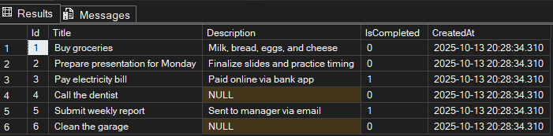

Проект использует одну таблицу `Tasks` в базе данных `Task3Db` для хранения информации о задачах.



```sql
CREATE TABLE Tasks
(
    Id          INT PRIMARY KEY IDENTITY (1,1),
    Title       NVARCHAR(255) NOT NULL,
    Description NVARCHAR(MAX) NULL,
    IsCompleted BIT           NOT NULL DEFAULT 0,
    CreatedAt   DATETIME      NOT NULL DEFAULT GETDATE()
)
```